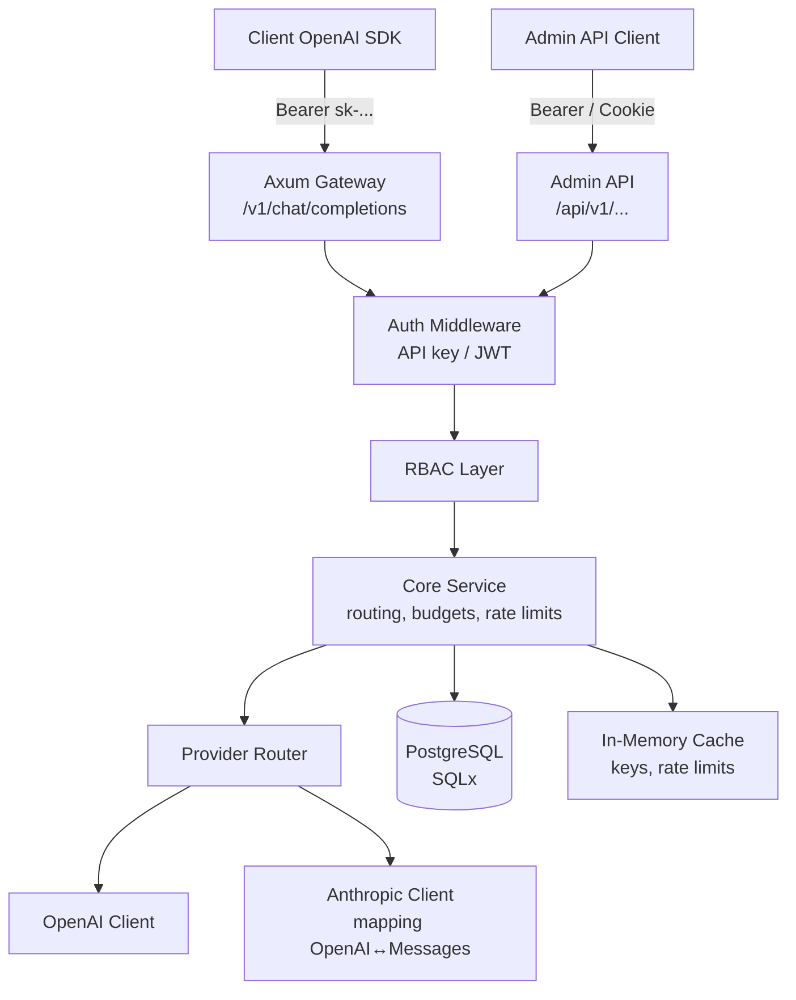
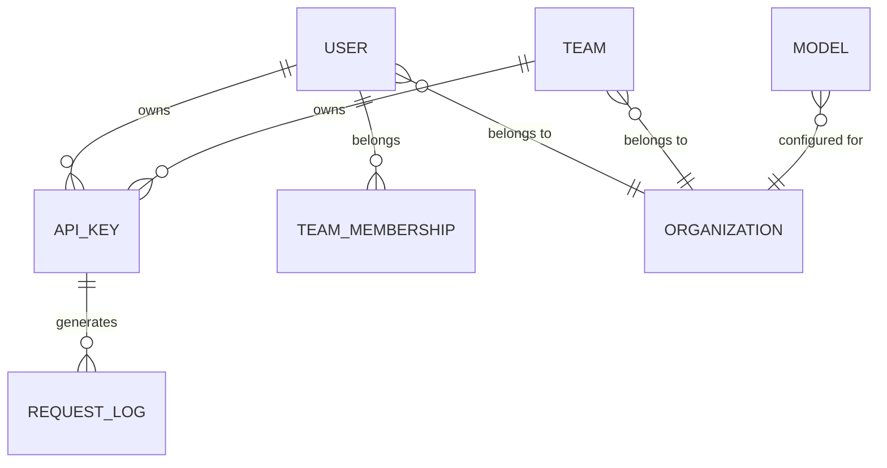

# Godwit MVP — Design Specification

## 1. Goal

Build a minimal but production-grade Rust clone of LiteLLM named **Godwit**. The MVP exposes an OpenAI-compatible chat-completions proxy, supports OpenAI and Anthropic backends, manages users/teams/organizations, and authenticates requests via API keys, OIDC, and SAML with role-based access control.

## 2. Scope

### In Scope
- OpenAI-compatible `/v1/chat/completions` and `/v1/models`.
- Backend providers: OpenAI and Anthropic (with OpenAI ↔ Anthropic request/response mapping).
- Streaming (`stream: true`) for both providers.
- API-key authentication for the proxy endpoint.
- Admin REST API for users, teams, organizations, API keys, models, and spend.
- OIDC and SAML SSO for admin users.
- RBAC: `super_admin`, `org_admin`, `team_admin`, `user`.
- PostgreSQL persistence via SQLx with embedded migrations.
- Unit and integration tests.
- Docker and docker-compose deployment.

### Out of Scope
- Web admin UI (React/Vue) — planned post-MVP.
- Additional providers (Azure, Bedrock, Vertex, Cohere, etc.).
- Advanced routing: fallbacks, retries, load-balancing across multiple deployments of the same model.
- Distributed rate limiting / caching (Redis).
- Prometheus metrics and structured logging pipelines.
- Billing webhooks and alerts.

## 3. Architecture

### 3.1 High-level diagram



### 3.2 Architectural style

**Modular monolith (Approach A).** All components run in a single binary but are separated into distinct crates/modules with well-defined interfaces. This minimizes operational overhead while keeping the door open to extract services later (Approach B/C).

### 3.3 Crate layout

Workspace Cargo with the following crates:

| Crate | Responsibility |
|-------|----------------|
| `godwit-core` | Domain models, error types, provider trait, configuration structs. No external I/O. |
| `godwit-db` | SQLx migrations, connection pool, repositories for users/orgs/teams/keys/models/logs. |
| `godwit-auth` | API-key hashing/validation, JWT issue/verify, OIDC client, SAML ACS, RBAC enforcement. |
| `godwit-providers` | HTTP clients for OpenAI and Anthropic, request/response mapping, streaming SSE handling. |
| `godwit-api` | Axum routers, middleware, state assembly, OpenAPI-compatible request/response DTOs. |
| `godwit-bin` | `main.rs`, CLI argument parsing, configuration loading, graceful shutdown. |

## 4. Technology Choices

| Concern | Choice | Rationale |
|---------|--------|-----------|
| HTTP framework | Axum | Native Tower middleware, excellent async Rust ergonomics, widely adopted. |
| Async runtime | Tokio | Standard in Rust ecosystem. |
| Database | PostgreSQL 16 | Relational data with strong consistency (users, teams, spend). |
| Database access | SQLx + `sqlx migrate` | Compile-time checked queries, no hidden runtime ORM complexity. |
| HTTP client | reqwest + rustls | Async, streaming-friendly, pure-Rust TLS. |
| JSON | serde + serde_json | Standard. |
| API key hashing | Argon2id via `argon2` crate | Secure key storage. |
| OIDC | `openidconnect` crate | Mature, spec-compliant. |
| SAML | `samael` crate | Native Rust SAML Service Provider. |
| Configuration | `config` + `figment` or `clap` + serde | Environment-first with optional YAML overlay. |
| Testing | `tokio::test`, `sqlx::test`, `wiremock`, `mockall` | Unit, integration, contract tests. |
| Container | Docker multi-stage + cargo-chef | Fast rebuilds. |

## 5. Data Model

### 5.1 Entities



### 5.2 Tables

```sql
CREATE TABLE organizations (
    id UUID PRIMARY KEY DEFAULT gen_random_uuid(),
    name TEXT NOT NULL,
    rate_limit_requests_per_minute INTEGER,
    created_at TIMESTAMPTZ NOT NULL DEFAULT NOW()
);

CREATE TABLE users (
    id UUID PRIMARY KEY DEFAULT gen_random_uuid(),
    organization_id UUID REFERENCES organizations(id),
    email TEXT NOT NULL UNIQUE,
    name TEXT,
    role TEXT NOT NULL CHECK (role IN ('super_admin','org_admin','team_admin','user')),
    sso_provider TEXT, -- 'oidc', 'saml', or NULL for API-key-only service accounts
    sso_subject TEXT,
    password_hash TEXT, -- NULL for SSO-only users
    created_at TIMESTAMPTZ NOT NULL DEFAULT NOW(),
    UNIQUE(sso_provider, sso_subject)
);

CREATE TABLE teams (
    id UUID PRIMARY KEY DEFAULT gen_random_uuid(),
    organization_id UUID NOT NULL REFERENCES organizations(id),
    name TEXT NOT NULL,
    created_at TIMESTAMPTZ NOT NULL DEFAULT NOW()
);

CREATE TABLE team_memberships (
    user_id UUID NOT NULL REFERENCES users(id) ON DELETE CASCADE,
    team_id UUID NOT NULL REFERENCES teams(id) ON DELETE CASCADE,
    role TEXT NOT NULL CHECK (role IN ('team_admin','member')),
    PRIMARY KEY (user_id, team_id)
);

CREATE TABLE api_keys (
    id UUID PRIMARY KEY DEFAULT gen_random_uuid(),
    user_id UUID NOT NULL REFERENCES users(id),
    team_id UUID REFERENCES teams(id),
    organization_id UUID NOT NULL REFERENCES organizations(id),
    name TEXT NOT NULL,
    key_prefix TEXT NOT NULL,
    key_hash TEXT NOT NULL UNIQUE,
    scopes TEXT[] NOT NULL DEFAULT ARRAY['proxy:write'],
    budget_limit_usd NUMERIC(12,4),
    budget_spent_usd NUMERIC(12,4) NOT NULL DEFAULT 0,
    rate_limit_requests_per_minute INTEGER,
    expires_at TIMESTAMPTZ,
    disabled BOOLEAN NOT NULL DEFAULT FALSE,
    created_at TIMESTAMPTZ NOT NULL DEFAULT NOW()
);

CREATE TABLE models (
    id UUID PRIMARY KEY DEFAULT gen_random_uuid(),
    organization_id UUID NOT NULL REFERENCES organizations(id),
    public_id TEXT NOT NULL, -- e.g. "gpt-4o" or "claude-sonnet"
    provider TEXT NOT NULL CHECK (provider IN ('openai','anthropic')),
    provider_model_id TEXT NOT NULL, -- e.g. "gpt-4o" or "claude-3-5-sonnet-20240620"
    config JSONB NOT NULL DEFAULT '{}',
    created_at TIMESTAMPTZ NOT NULL DEFAULT NOW(),
    UNIQUE(organization_id, public_id)
);

CREATE TABLE model_pricing (
    model_id UUID PRIMARY KEY REFERENCES models(id) ON DELETE CASCADE,
    input_price_per_1k NUMERIC(12,6) NOT NULL, -- USD per 1k input tokens
    output_price_per_1k NUMERIC(12,6) NOT NULL, -- USD per 1k output tokens
    effective_from TIMESTAMPTZ NOT NULL DEFAULT NOW(),
    effective_until TIMESTAMPTZ
);

CREATE TABLE request_logs (
    id UUID PRIMARY KEY DEFAULT gen_random_uuid(),
    api_key_id UUID REFERENCES api_keys(id),
    user_id UUID REFERENCES users(id),
    organization_id UUID NOT NULL REFERENCES organizations(id),
    team_id UUID REFERENCES teams(id),
    model TEXT NOT NULL,
    provider TEXT NOT NULL,
    provider_model_id TEXT NOT NULL,
    tokens_in INTEGER,
    tokens_out INTEGER,
    cost_usd NUMERIC(12,6),
    duration_ms INTEGER NOT NULL,
    streamed BOOLEAN NOT NULL DEFAULT FALSE,
    status TEXT NOT NULL, -- 'success', 'error', 'rate_limited'
    error_message TEXT,
    created_at TIMESTAMPTZ NOT NULL DEFAULT NOW()
);
```

## 6. API Surface

### 6.1 Proxy endpoints (OpenAI-compatible)

| Method | Path | Auth | Description |
|--------|------|------|-------------|
| GET | `/v1/models` | API key | List configured models. |
| POST | `/v1/chat/completions` | API key | Chat completion, supports `stream`. |

### 6.2 Admin endpoints

| Method | Path | Auth | RBAC |
|--------|------|------|------|
| POST | `/api/v1/auth/login` | email/password | — |
| GET | `/api/v1/auth/oidc/{provider}` | — | Initiates OIDC flow. |
| GET | `/api/v1/auth/oidc/{provider}/callback` | — | OIDC callback. |
| POST | `/api/v1/auth/saml/{provider}/acs` | SAMLResponse | SAML ACS. |
| POST | `/api/v1/auth/refresh` | JWT | Refresh access token. |
| GET | `/api/v1/me` | JWT | Current user. |
| GET/POST | `/api/v1/users` | JWT | `super_admin`, `org_admin` |
| GET/PATCH/DELETE | `/api/v1/users/{id}` | JWT | role-based |
| GET/POST | `/api/v1/organizations` | JWT | `super_admin` |
| GET/POST | `/api/v1/teams` | JWT | `org_admin`+ |
| GET/POST | `/api/v1/api-keys` | JWT | `team_admin`+ |
| DELETE | `/api/v1/api-keys/{id}` | JWT | owner or `team_admin`+ |
| GET/POST | `/api/v1/models` | JWT | `org_admin`+ |
| DELETE | `/api/v1/models/{id}` | JWT | `org_admin`+ |
| GET | `/api/v1/spend` | JWT | `org_admin`+ |

### 6.3 Error format

All errors return `application/problem+json` per RFC 7807:

```json
{
  "type": "https://api.godwit.local/errors/validation-error",
  "title": "Validation Error",
  "status": 422,
  "detail": "The 'email' field must be a valid email address.",
  "instance": "/api/v1/users"
}
```

## 7. Authentication & Authorization

### 7.1 API keys
- Format: `sk-godwit-{base58(24 random bytes)}`.
- Storage: store the first 16 characters as `key_prefix` (lookup only) and the full-key Argon2id hash as `key_hash`. The plaintext is returned only once at creation.
- Middleware extracts `Authorization: Bearer <key>`, looks up candidate keys by prefix, verifies Argon2id hash, then validates scopes, expiry, and budget.

### 7.2 OIDC
- Configured per organization in `config.yaml`.
- Initiates Authorization Code flow with PKCE.
- On callback, verifies ID token, extracts `email`, `sub`, and optional `name`.
- Creates or updates `users` row with `sso_provider='oidc'` and `sso_subject=<sub>`.
- Issues short-lived JWT access token + refresh token.

### 7.3 SAML
- Configured Service Provider metadata per organization.
- `POST /api/v1/auth/saml/{provider}/acs` receives `SAMLResponse`.
- Validates signature, extracts `NameID`/email and SAML attributes.
- Maps to `users` row with `sso_provider='saml'`.

### 7.4 RBAC
- Roles are stored on `users.role` and `team_memberships.role`.
- Admin routes require JWT and check role/organization/team ownership.
- API keys carry `scopes` array; proxy access requires `proxy:write`.

### 7.5 Rate limiting (MVP)
- In-memory token bucket per `api_key_id` and per `organization_id`.
- Limits configured on `api_keys` (`rate_limit_requests_per_minute`) and `organizations` (`rate_limit_requests_per_minute`).
- Exceeding a limit returns HTTP 429 with `Retry-After`.
- Distributed rate limiting (Redis) is out of scope for MVP.

## 8. Provider Abstraction

### 8.1 Provider trait

```rust
#[async_trait]
pub trait Provider: Send + Sync {
    async fn chat_completion(
        &self,
        request: ChatCompletionRequest,
    ) -> Result<ProviderResponse, ProviderError>;

    async fn stream_chat_completion(
        &self,
        request: ChatCompletionRequest,
    ) -> Result<BoxStream<'static, Result<SseEvent, ProviderError>>, ProviderError>;
}
```

### 8.2 OpenAI provider
- Forwards `ChatCompletionRequest` JSON almost unchanged.
- Returns JSON or SSE stream directly to the client.

### 8.3 Anthropic provider
- Maps OpenAI `ChatCompletionRequest` → Anthropic `MessagesRequest`.
- Maps Anthropic `Message` response → OpenAI `ChatCompletion`.
- Maps Anthropic SSE stream → OpenAI `ChatCompletionChunk` SSE stream.
- Tool calls and system messages are converted where semantics differ.

## 9. Configuration

Example `config.yaml`:

```yaml
server:
  host: 0.0.0.0
  port: 3000
  request_timeout_seconds: 120

database:
  url: "${DATABASE_URL}"

auth:
  jwt_secret: "${JWT_SECRET}"
  access_token_ttl_minutes: 15
  refresh_token_ttl_days: 7
  oidc_providers:
    - id: google
      issuer_url: "https://accounts.google.com"
      client_id: "${GOOGLE_CLIENT_ID}"
      client_secret: "${GOOGLE_CLIENT_SECRET}"
      redirect_uri: "https://api.godwit.local/api/v1/auth/oidc/google/callback"
  saml_providers:
    - id: okta
      idp_metadata_url: "${OKTA_SAML_METADATA_URL}"
      sp_entity_id: "godwit"
      acs_url: "https://api.godwit.local/api/v1/auth/saml/okta/acs"

providers:
  openai:
    api_key: "${OPENAI_API_KEY}"
    base_url: "https://api.openai.com/v1"
  anthropic:
    api_key: "${ANTHROPIC_API_KEY}"
    base_url: "https://api.anthropic.com/v1"
```

## 10. Testing Strategy

### 10.1 Unit tests
- Pure mapping logic: OpenAI ↔ Anthropic request/response conversion.
- RBAC permission checks for each role.
- Budget and rate-limit arithmetic.
- API-key prefix/hash extraction.
- Configuration parsing and validation.

### 10.2 Integration tests
- Spin up an Axum app with an in-memory or test-database state.
- Test proxy endpoint with mocked provider responses (`wiremock`).
- Test admin CRUD flows with JWT authentication.
- Test OIDC/SAML callback flows with mocked identity providers.

### 10.3 Database tests
- Use `sqlx::test` against a temporary PostgreSQL database (Testcontainers or dedicated test DB).
- Cover migrations, repositories, and transactional boundaries.

### 10.4 E2E tests
- Docker Compose stack.
- Smoke tests with real provider credentials (optional, gated).

## 11. Deployment

### 11.1 Local development
```bash
docker compose up db
cargo run --bin godwit
```

### 11.2 Production
- Multi-stage `Dockerfile` using `cargo-chef` for dependency caching.
- `docker-compose.yml` with PostgreSQL and health checks.
- Run `sqlx migrate run` before starting the application.
- Expose port 3000.

### 11.3 Environment variables
- `DATABASE_URL`
- `JWT_SECRET`
- `OPENAI_API_KEY`
- `ANTHROPIC_API_KEY`
- Provider OIDC/SAML secrets as referenced in `config.yaml`.

## 12. Roadmap Beyond MVP

1. Extract authentication into a dedicated service (Approach B).
2. Add Redis for distributed rate limiting and caching.
3. Add NATS/SQS for async request logging and spend aggregation (Approach C).
4. Build React/Vue admin UI.
5. Add Azure OpenAI, AWS Bedrock, Google Vertex, Cohere providers.
6. Implement model fallbacks, retries, and load balancing.
7. Prometheus metrics, OpenTelemetry tracing, structured logging.

## 13. Acceptance Criteria

- [ ] `POST /v1/chat/completions` with OpenAI backend returns a valid OpenAI response.
- [ ] Same endpoint with an Anthropic-configured model returns OpenAI-shaped response.
- [ ] `stream: true` returns valid SSE chunks for both providers.
- [ ] API-key middleware rejects invalid/budget-exceeded keys.
- [ ] Admin users can CRUD users, teams, orgs, API keys, models.
- [ ] OIDC login creates/links a user and returns a JWT.
- [ ] SAML ACS creates/links a user and returns a JWT.
- [ ] RBAC prevents a `user` from accessing admin endpoints.
- [ ] All unit tests pass with `cargo test`.
- [ ] Integration tests pass against a test PostgreSQL instance.
- [ ] Application starts from `docker compose up`.
